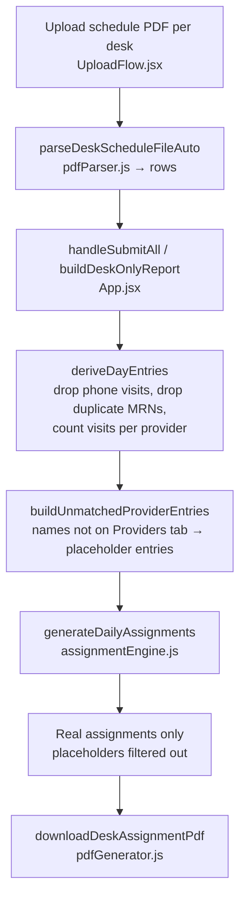
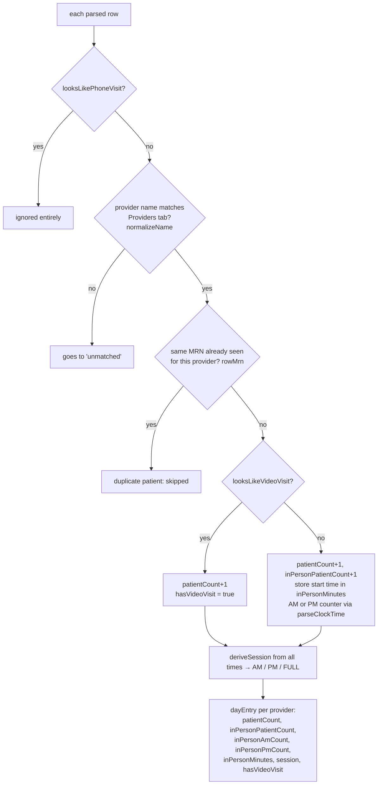
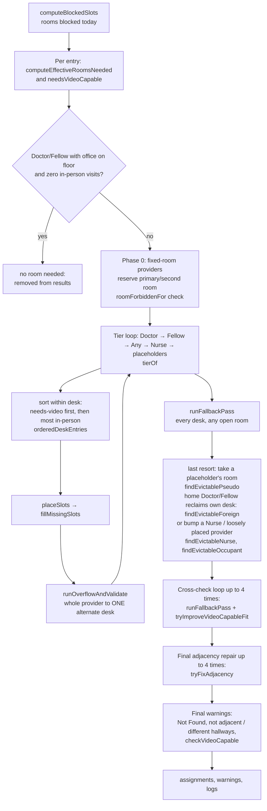
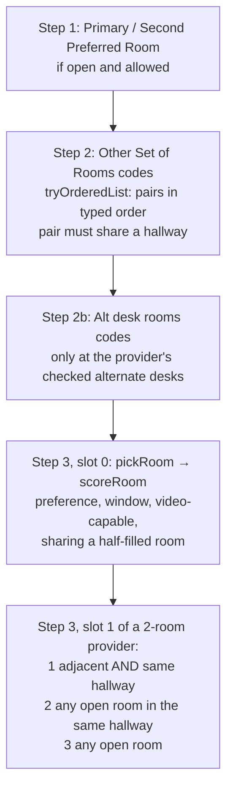

# How a provider gets their room(s)

This document traces the code path from an uploaded schedule PDF to the rooms printed in the exported PDF. Every box and every line of pseudocode names a real function in this repo.

Files involved:

| File | Role |
|------|------|
| `src/components/UploadFlow.jsx` | Upload UI, calls the parser |
| `src/logic/pdfParser.js` | Reads the PDF rows, removes duplicates, counts visits per provider |
| `src/App.jsx` | `handleSubmitAll` / `buildDeskOnlyReport` wire everything together |
| `src/logic/assignmentEngine.js` | `generateDailyAssignments` — all room-placement rules |
| `src/logic/pdfGenerator.js` | `downloadDeskAssignmentPdf` — prints the result |

## 1. End-to-end flow



## 2. Inside `deriveDayEntries` (what decides how many rooms and which kind)



## 3. Inside `generateDailyAssignments`



### `fillMissingSlots` — how one provider's room is chosen at one desk



## 4. Pseudocode

```text
FUNCTION handleSubmitAll(rowsByDesk):                        // App.jsx
    rows        = all desks' rows
    entries, unmatched = deriveDayEntries(rows, providers)
    placeholders       = buildUnmatchedProviderEntries(unmatched, desks)
    assignments = generateDailyAssignments(desks, rooms, providers + placeholders.providers,
                                            entries + placeholders.entries, date)
    real = assignments WITHOUT placeholder entries
    FOR each desk: downloadDeskAssignmentPdf(desk, rooms, real, providers)


FUNCTION deriveDayEntries(rows, providers):                   // pdfParser.js
    FOR each row:
        IF looksLikePhoneVisit(row): CONTINUE                 // telephone visits don't count at all
        provider = match normalizeName(row.provider) to Providers tab
        IF none: add row to unmatched; CONTINUE
        IF rowMrn(row) already seen for this provider: CONTINUE   // duplicate patient
        patientCount += 1
        IF looksLikeVideoVisit(row): hasVideoVisit = true
        ELSE: inPersonPatientCount += 1
              minutes = parseClockTime(row.time)
              inPersonMinutes.push(minutes)
              count it in inPersonAmCount (before noon) or inPersonPmCount
    session = deriveSession(all times)                        // AM, PM or FULL
    RETURN one entry per provider


FUNCTION computeEffectiveRoomsNeeded(provider, entry):        // assignmentEngine.js
    IF provider.type == Nurse:             RETURN 1
    IF provider.preferredNumberOfRooms != 2: RETURN configured value
    IF exactly 2 in-person visits AND their start times are >= 120 min apart: RETURN 1
    IF inPersonAmCount <= 1 AND inPersonPmCount <= 1:      RETURN 1
    RETURN 2


FUNCTION generateDailyAssignments(desks, rooms, providers, dayEntries, roomBlocks, date):
    blocked = computeBlockedSlots(roomBlocks, date)
    FOR each working entry:
        needsVideoCapable    = hasVideoVisit AND NOT provider.hasOfficeOnFloor
        effectiveRoomsNeeded = computeEffectiveRoomsNeeded(provider, entry)
    DROP Doctor/Fellow who have an office on the floor and zero in-person visits

    // Phase 0
    FOR each fixed-room provider with patients today:
        reserve primary (and second, if effectiveRoomsNeeded == 2)
        IF room is blocked, taken, or roomForbiddenFor(entry): slot = Not Found + warning

    // Phases 1+2: priority tiers
    FOR tier IN [Doctor, Fellow, Any, Nurse, unmatched-name placeholders]:   // tierOf
        FOR each desk:
            entries = tier's entries whose home desk is this desk
            SORT entries: needsVideoCapable first, then more in-person patients first
            FOR each entry:
                slots = placeSlots(desk, entry, effectiveRoomsNeeded)        // -> fillMissingSlots
        runOverflowAndValidate(tier's assignments)
            // only if NO room was placed at home: try ONE alternate desk
            // (lowest in-person patient load first) that fits all missing rooms

    // Phase 3: last-resort sweep
    runFallbackPass():
        FOR each entry still missing a room, Doctor -> Fellow -> Any -> Nurse:
            FOR each desk in deskSearchOrder(entry):             // home, alternates by load, then all others
                fillMissingSlots(desk, entry, missing slots)
            IF still missing (real providers only):
                1. findEvictablePseudo     -> take a placeholder's room
                1b. Doctor/Fellow only: findEvictableForeign -> take back a room at the
                    HOME desk from a foreign provider, relocateEvictedOccupant
                2. findEvictableNurse      -> bump a Nurse, relocateEvictedNurse
                3. second room of a pair: findEvictableOccupant -> relocateEvictedOccupant
                   (same or lower priority, never fixed-room, rolled back if the evicted
                    provider cannot be relocated)

    // Phase 4: cross-check
    REPEAT up to 4 times while something changes:
        collapseSplitProviders()      // 2-room provider on two desks -> keep home desk's room, free the other
        runFallbackPass()
        tryImproveVideoCapableFit()   // swap into a video-capable room when needed and safe

    // Phase 5: two-room validation
    REPEAT up to 4 times while something changes:
        FOR each provider needing 2 rooms (not fixed-room, not an explicit Primary+Second pair):
            IF NOT roomsAdjacentById(slot0, slot1):        // adjacent AND same hallway
                tryFixAdjacency(...)      // move to an adjacent open room, or evict a
                                          // "loosely placed" occupant who can be relocated

    // Final report
    FOR each assignment:
        warn if a slot is Not Found
        warn if a 2-room pair is not adjacent / in two hallways
    checkVideoCapable(assignments)        // warn if video-capable room was needed and missing
    RETURN assignments, warnings, logs


FUNCTION fillMissingSlots(desk, entry, missingSlots, anchorRoomIdForSlot1):
    1. FOR each missing slot: use primaryPreferredRoomId (slot 0) / secondPreferredRoomId (slot 1)
       if it is at this desk, open, and NOT roomForbiddenFor(entry)
    2. tryOrderedList(otherSetRoomIdsInOrder)      // "Other Set of Rooms"
       tryOrderedList(altDeskRoomIdsInOrder)       // "Alt desk rooms", only at checked alternate desks
         - both slots missing: try consecutive pairs in typed order; a pair must share a hallway
         - slot 1 only: prefer adjacent+same hallway, then same hallway, then the rest
    3. slot 0:  pickRoom(desk, entry)               // scoreRoom ranks candidates
       slot 1:  pickRoom(... adjacent to slot 0 AND same hallway)
                ELSE pickRoom(... same hallway as slot 0)
                ELSE pickRoom(... any open room)    // never leave Not Found if a room is open
    // pickRoom always skips rooms that are blocked, taken, or roomForbiddenFor(entry)

FUNCTION roomForbiddenFor(entry, room):
    RETURN entry.type in [Doctor, Fellow] AND room is at a desk named/identified "west"
           AND room.code starts with "6"

FUNCTION scoreRoom(room, entry, preferredRoomId):
    +10 exact preferred room, +7 in Other Set of Rooms, +5 video-capable when needed,
    +5 in Alt desk rooms (only at that alternate desk), +2 window preference,
    +4 / +1 for sharing an already half-filled room (light day / normal day)
```

## 5. Where each rule lives

| Rule | Function |
|------|----------|
| Duplicate patients removed | `deriveDayEntries` (`rowMrn`, `seenMrns`) |
| Phone visits ignored, video flagged | `looksLikePhoneVisit`, `looksLikeVideoVisit` |
| How many rooms | `computeEffectiveRoomsNeeded` |
| Which kind of room (video-capable) | `needsVideoCapable`, `scoreRoom`, `tryImproveVideoCapableFit` |
| No room needed (Doctor/Fellow, all virtual) | filter in `generateDailyAssignments` |
| Doctor → Fellow → Any → Nurse order | `tierOf`, `TYPE_PRIORITY` |
| Contested room tie-break | `orderedDeskEntries` sort |
| Never split across desks | `runOverflowAndValidate`, `deskSearchOrder` (desk lock), `collapseSplitProviders` |
| Two-room adjacency and hallway | `roomsAdjacentById`, `sameHall`, `tryFixAdjacency` |
| West "6" rule | `roomForbiddenFor` |
| Home desk first (Doctor/Fellow reclaim own desk's rooms) | `findEvictableForeign` in `runFallbackPass` |
| Nurse never left without a room | `runFallbackPass`, `findEvictablePseudo` |
| Printed report | `downloadDeskAssignmentPdf` |
